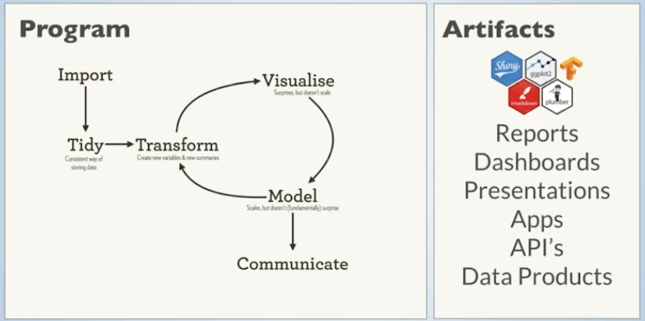
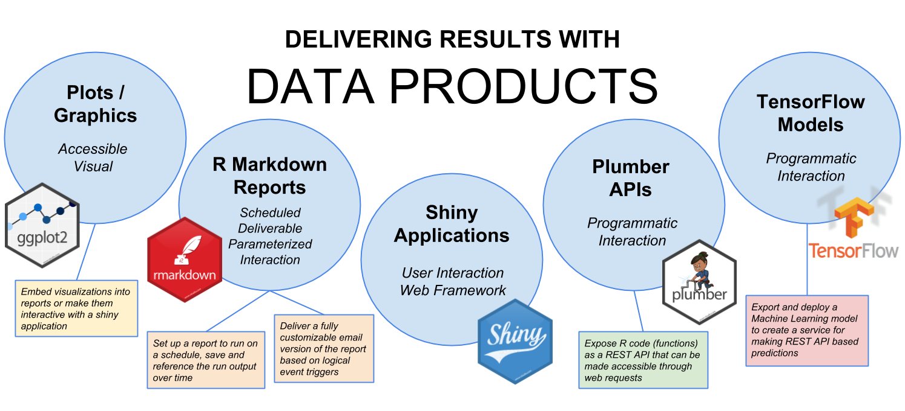
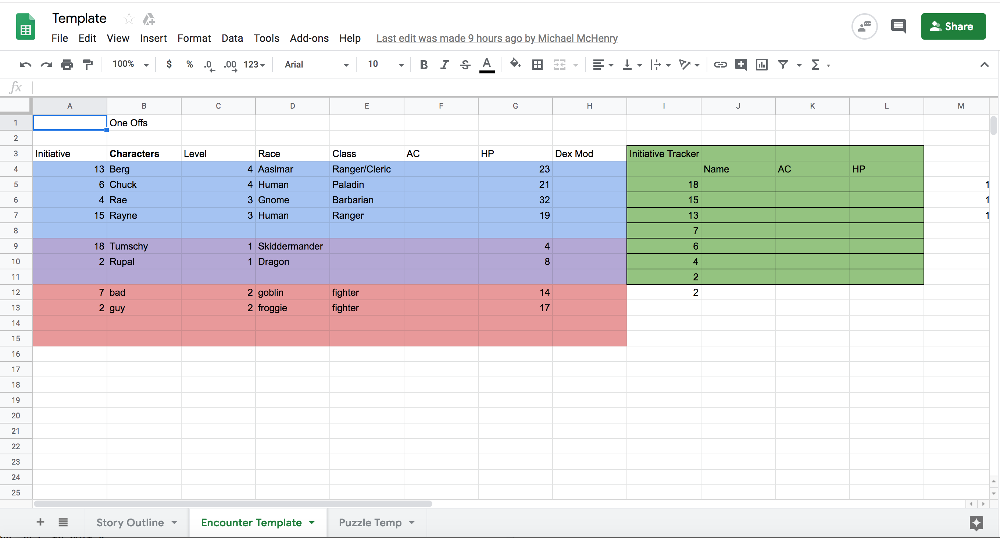
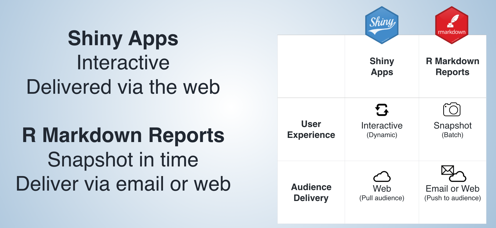
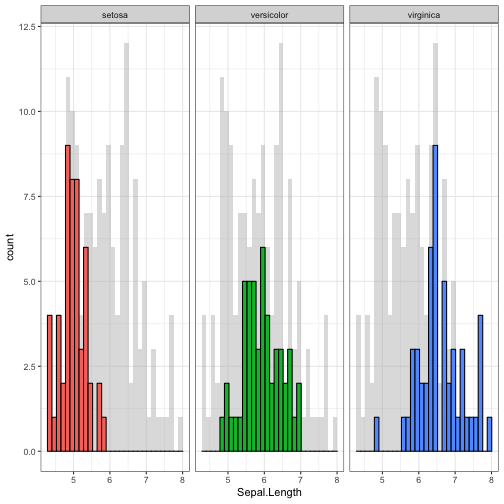
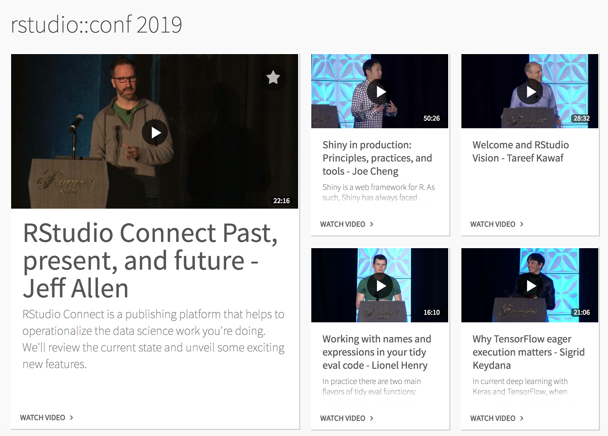

The R User's Guide to Result Delivery Through Data Products
========================================================
author: Kelly O'Briant
date: PhUSE 2019
autosize: true

The R For Data Science Workflow
========================================================



- Access
- Understand
- Communicate

***

# --- #

**R** is an open source programming language for statistical computing

**RStudio** provides open source and enterprise-ready professional software for data science

What are Data Products?
========================================================

# --- #

- The artifacts through which you communicate, share and provide access to your ideas and analyses
- Reports, Visualizations, Applications, Services, Dashboards
- Data Storytelling Devices

--

## "It doesn't matter how great your analysis is unless you can explain it to others: you need to **communicate** your results." 
#### - Wickham & Grolemund  _R for Data Science_


Explore Common R Data Product Packages
========================================================

**R is supported by a rich ecosystem of open source packages**




Why is using R for data products empowering?
========================================================

# --- #

### 1. Opportunity to delight
### 2. Options for different communication styles and needs
### 3. Leverage code and version control for reproducibility
### 4. Justify worth: proof that you can contribute meaningful work


What does it mean to deliver delight?
========================================================

# --- #

## My goal is this:

- Work that I'm proud to show off
- Communication with excellent user experience

***

## Not this:




Should all my spreadsheets be Shiny apps?
========================================================




Crucial Weekly Data Update
========================================================


```r
library(ggplot2)

irisinfo <- ggplot(iris, aes_string(x = "Sepal.Length", fill = "Species")) +
  geom_histogram(data = iris[,-5], fill = "grey", alpha = .5) +
  geom_histogram(colour = "black") +
  facet_wrap(~ Species) +
  guides(fill = FALSE) +
  theme_bw()
```

***
**The latest in "Sepal Length" news**




That was a brief introduction to data products in R
========================================================

# --- #

## Resources for learning more:

- RStudio Community - [rstd.io/community](http://rstd.io/community)
- Twitter - [rstd.io/twitter](http://rstd.io/twitter)
- Webinars - [resources.rstudio.com](http://resources.rstudio.com)
- Solutions - [solutions.rstudio.com](https://solutions.rstudio.com/)

***



## RStudio Conference 2019 Talks

This data product is reproducible!
========================================================

# --- #

# All the code for this presentation can be found here:
